**This modlist is meant as a basis to start your own Skyrim modding journey, it includes all the essential fixes & tools.**

Originally created by Luca (EzioTheDeadPoet), now maintained by trawzified and Luca.

## Index

- [Index](#index)
- [Description](#description)
  - [What's included in this list?](#whats-included-in-this-list)
    - [Tools](#tools)
    - [Mods](#mods)
- [Installation](#installation)
  - [Required Accounts](#required-accounts)
  - [Pre-Installation](#pre-installation)
    - [Installing Microsoft Visual C++ Redistributable Package](#installing-microsoft-visual-c-redistributable-package)
    - [Installing .NET 5.0](#installing-net-50)
    - [Steam Config](#steam-config)
      - [Game Location](#game-location)
      - [Disable the Steam Overlay](#disable-the-steam-overlay)
      - [Change Steams Update Behavior](#change-steams-update-behavior)
      - [Set the Game language to English](#set-the-game-language-to-english)
    - [Clean Skyrim](#clean-skyrim)
    - [Start Skyrim](#start-skyrim)
  - [Using Wabbajack](#using-wabbajack)
    - [Preparations](#preparations)
    - [Downloading and Installing](#downloading-and-installing)
      - [Manual Downloads](#manual-downloads)
      - [Problems with Wabbajack](#problems-with-wabbajack)
        - [Could not download x](#could-not-download-x)
        - [x is not a whitelisted download](#x-is-not-a-whitelisted-download)
        - [Wabbajack could not find my game folder](#wabbajack-could-not-find-my-game-folder)
        - [Windows is reporting that a virus has been detected](#windows-is-reporting-that-a-virus-has-been-detected)
  - [Post-installation](#post-installation)
    - [Creation Kit](#creation-kit)
    - [xEdit & xEdit based applications (DynDOLOD, xLodGen)](#xedit--xedit-based-applications-dyndolod-xlodgen)
    - [Nemesis](#nemesis)
    - [Synthesis](#synthesis)
    - [zEdit](#zedit)
    - [Easy NPC](#easy-npc)
    - [PCA SE](#pca-se)
    - [BethINI / Visuals](#bethini--visuals)
- [How to Launch SME(FT)](#how-to-launch-smeft)
- [Updating](#updating)
- [Ultrawide Fix](#ultrawide-fix)
- [FAQ](#faq)
  - [Are there ultrawide options available?](#are-there-ultrawide-options-available)
- [Credits and Thanks](#credits-and-thanks)
- [Contact](#contact)

## Description

This modlist is a utility for modders, to speed up their initial modding setup, or for people who want to play vanilla Skyrim with all the unofficial patches and fixes.
It can also be utilized as a test bench for developing new mods on a stable base.

If you want to learn more about modding Skyrim, you could read up on it on [the /r/skyrimmods wiki](https://www.reddit.com/r/skyrimmods/wiki/begin2) or follow the [lessons on the Learn to Mod page](https://github.com/LivelyDismay/Learn-To-Mod/blob/main/Main.md) on how to get started.

### What's included in this list?

Previously, SMEFT included profiles for people that want to use specific animation engines. However, the best option is clearly [Nemesis](https://github.com/ShikyoKira/Project-New-Reign---Nemesis-Main/releases/latest) unless you want a very particular set of animal mods found on LoversLab.

The list contains mods that fall into 4 categories.

#### Tools
- [BethINI](http://nexusmods.com/skyrimspecialedition/mods/4875)
- [BodySlide and Outfit Studio](http://nexusmods.com/skyrimspecialedition/mods/201)
- [deorder's MO2 Plugins](https://github.com/deorder/mo2-plugins)
   - **Merge Plugins Hide**: Hide / unhide plugins that were merged using *Merge Plugins* or *zMerge*.
   - **Sync Mod Order**: Sync mod order from current profile to another while keeping the (enabled/disabled) state intact.
- [Dynamic Distant Objects LOD - DynDOLOD](https://www.nexusmods.com/skyrim/mods/59721)
   - This does **NOT** include the resources found on the same page.
- [LOOT](https://github.com/loot/loot)
- [NifSkope](https://github.com/niftools/nifskope)
- [Papyrus Compiler App (Mod Organizer 2 Integration) SE](http://nexusmods.com/skyrimspecialedition/mods/23852)
- [SSEEdit](https://nexusmods.com/skyrimspecialedition/mods/164)
- [SSELODGen](https://www.nexusmods.com/skyrimspecialedition/mods/6642)
- [Synthesis](https://github.com/Noggog/Synthesis)
- [Unofficial Mator Smash Updated](https://www.nexusmods.com/skyrimspecialedition/mods/39378)
- [Wrye Bash](https://www.nexusmods.com/skyrimspecialedition/mods/6837)
- [zEdit](https://github.com/z-edit/zedit)

#### Mods

## Installation

### Required Accounts

| Website                                               | Comment                                                                  | Mandatory |
|-------------------------------------------------------|--------------------------------------------------------------------------|-----------|
| [Nexus Mods](https://users.nexusmods.com/register)    | Premium highly recommended for automated and faster downloads.           | Yes       |
| [Bethesda.net](https://www.bethesda.net/en/dashboard) | Required to install the Creation Kit the official Bethesda modding tool. | No        |

### Pre-Installation

These steps are only needed if you install this Modlist for the first time.

#### Installing Microsoft Visual C++ Redistributable Package

I doubt you need to do this since you likely already have this installed. The package is required for MO2 and you can download it from [Microsoft](https://support.microsoft.com/en-us/help/2977003/the-latest-supported-visual-c-downloads). Download the x64 version under "Visual Studio 2015, 2017 and 2019".

|[Direct link](https://aka.ms/vs/16/release/vc_redist.x64.exe)|

#### Installing .NET 5.0

This is a needed dependency for mods used with this list.
So please make sure to install it to avoid any issues. Download the desktop app x64 AND the console app x64 versions from [Microsoft](https://dotnet.microsoft.com/download/dotnet/5.0/runtime).

[Direct Link Desktop](https://download.visualstudio.microsoft.com/download/pr/1daf85dc-291b-4bb8-812e-a0df5cdb6701/85455a4a851347de26e2901e043b81e1/windowsdesktop-runtime-5.0.12-win-x64.exe) | [Direct Link Console](https://download.visualstudio.microsoft.com/download/pr/28b0479a-2ca7-4441-97f2-64a3d64b2ea4/9995401dac4787a2d1104c73c4356f4d/dotnet-runtime-5.0.12-win-x64.exe)

#### Steam Config

##### Game Location

Make sure your game is **NOT** installed in a _common folder_ like your `Desktop`, `Downloads` or `Program Files` folder (like the default steam location). If you only have one drive and can't create a second steam library with steam use LostDragonist's [steam-library-setup-tool](https://github.com/LostDragonist/steam-library-setup-tool/wiki/Usage-Guide) to create a second one on your main drive. When you have a new steam library setup move your game there **using the steam feature** to do so.

*Creating a new library with Steam:*

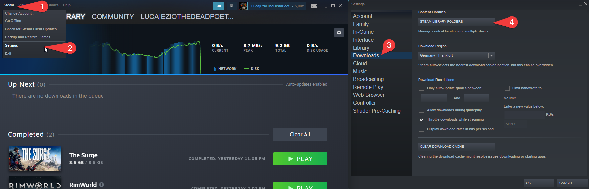
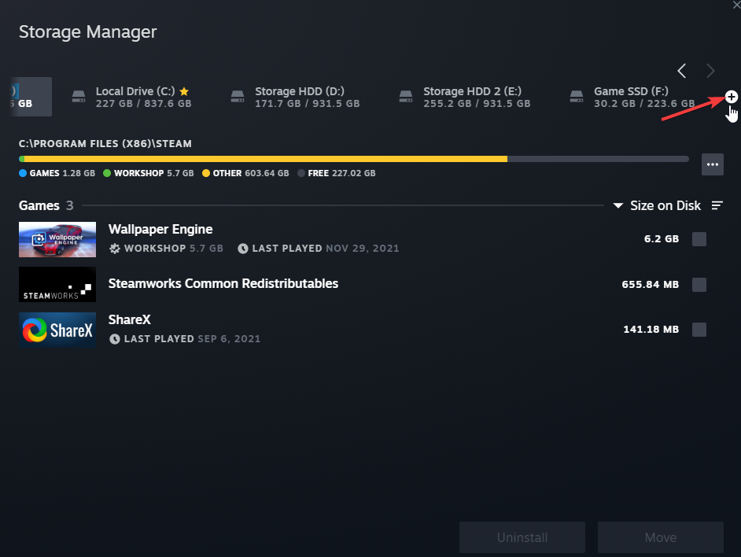

*Moving the Game:*

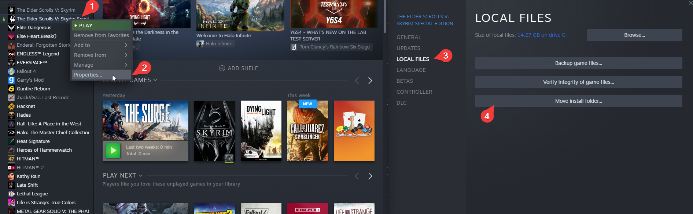
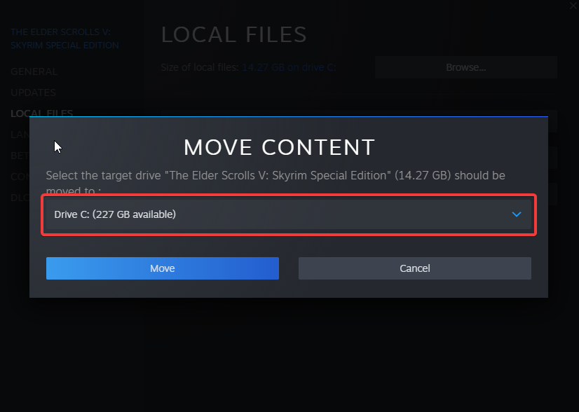

##### Disable the Steam Overlay

The Steam Overlay can cause issues with ENB and is recommended to be turned off when using and ENB, this list only uses ReShade which makes this step only necessary if you want to add an ENB yourself.

Open the Properties window (right-click the game in your Library->Properties), navigate to the _General_ tab, and un-tick the _Enable the Steam Overlay while in-game_ checkbox.

##### Change Steams Update Behavior

SSE is still being updated by Bethesda (they only add Creation Club content). Whenever the game updates, the entire modding community goes silent for the next one or two weeks because some mods need to be updated to the latest game runtime version.

To ensure that Steam does not automatically update the game for you, head over to the Properties window, navigate to the _Updates_ tab and change _Automatic updates_ to _Only update this game when I launch it_. You should also disable the Steam Cloud while you're at it.

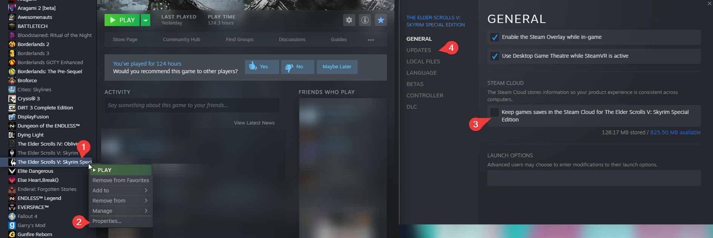
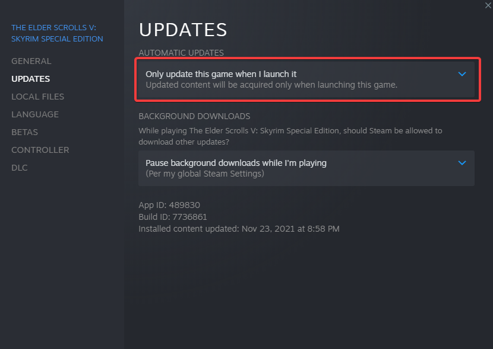

##### Set the Game language to English

Just do it. This entire Modlist is in English and 99% of all mods you will find are also in English. I highly recommend playing the game in English and **I can not give support to people with a non-English game**.

Open the Steam Properties window, navigate to the _Language_ tab and select _English_ from the dropdown menu.

#### Clean Skyrim

I highly recommend uninstalling the game through Steam, deleting the game folder, and reinstalling it. You should also clean up the `Skyrim Special Edition` folder in `Documents/My Games/` by deleting the contents in it.
But verifying your installation via steam should be enough, if the installation fails follow the steps above.

How to verify Skyrim Special Edition with Steam:

- Open your Steam Library tab
- Right-click Skyrim Special Edition
- Select Properties
- Select Local Files
- Select Verify Integrity of Local Files

#### Start Skyrim

After you have done everything above and got a clean Skyrim Special Edition installation, start the Launcher and let it do the initial graphics check. Do not worry about this part as the installation will replace these graphics settings.
Start the game and exit once you're on the main menu.

### Using Wabbajack

#### Preparations

Grab the latest release of Wabbajack from [here](https://www.wabbajack.org/#/) and place the `Wabbajack.exe` file in a _working folder_. This folder **must not** be in a _common folders_ like your `Desktop`, `Downloads` or `Program Files` folder. It's best to create a Wabbajack folder near the root level of your drive like `C:/Wabbajack`.

#### Downloading and Installing

The download and installation process can take a very long time depending on your system specs. Wabbajack will detect the optimal amount of threads at the beginning of the installation. To have the highest amount of threads and thus the fastest speed, it is advised to have the working folder on an SSD.

1. Select a folder for all the mods that need to be downloaded somewhere that is not affected by UAC (Please do not put it in Documents, Program Files, Desktop. Put it somewhere easy like `C:/Modlists/SME(FT)/downloads`(Replace "SME(FT)" with the name of a list you might want to create for Wabbajack) or `Modlists/Downloads`).
2. Download all the mods [here](#manual-downloads) manually and put them in the folder created in step 1 (The reason for this is, that mods hosted on mega are prone to cause issues when installing and compiling modlists, and the manual download step for them during the installation sometimes doesn't work or some files are just too big so they are likely to fail because of that and I had better chances of success downloading those files manually.).
3. Open Wabbajack
4. Click on the settings icon and log in with your Nexus Mods Account.
5. Click on `Browse Modlists`, enable `Only Utility Lists`, and download SME(FT) from the gallery.
6. Once the download is done set the Installation folder to somewhere that is not affected by UAC (Please do not put it in Documents, Program Files, Desktop. Put it somewhere easy like `C:/Modlists/SME(FT)`(Replace "SME(FT)" with the name of a list you might want to create for Wabbajack)). The downloads path should be the one you created in step 1.
7. Click the Go/Begin button
8. Wait for Wabbajack to finish
9. [Post-Installation](#post-installation)

##### Manual Downloads

The Nexus Mods file is only linked, because it is likely to cause issues because of the file size, which sometimes causes Wabbajack to fail the download.

| Host       | Mod                                    | Author                                                                           | Website                                                              | Download                                                                                              |
|------------|----------------------------------------|----------------------------------------------------------------------------------|----------------------------------------------------------------------|-------------------------------------------------------------------------------------------------------|
| Nexus Mods | Cleaned Skyrim SE Textures             | [Kartoffel](https://www.nexusmods.com/skyrimspecialedition/users/6129887)        | [Website](https://www.nexusmods.com/skyrimspecialedition/mods/38775) | [Direct Download](https://www.nexusmods.com/skyrimspecialedition/mods/38775?tab=files&file_id=248251) |

##### Problems with Wabbajack

There are a lot of different scenarios where Wabbajack will produce an error. I recommend re-running Wabbajack before posting anything. Wabbajack will continue where it left off so you lose no progress.

###### Could not download x

If a mod got updated and the old files got deleted, it is impossible to download them. In this case, just wait till I update the modlist.

###### x is not a whitelisted download

This can happen when I update the modlist. Check if a new update is available and wait if there is none.

###### Wabbajack could not find my game folder

Wabbajack will not work with a pirated version of the game. If you own the game on Steam, go back to the [Pre-Installation](#pre-installation) step. If you own the game make sure you did [start Skyrim once](#start-skyrim).

###### Windows is reporting that a virus has been detected

Windows 10 has started to auto-quarantine the usvfs_proxy_x86.exe file from the latest version of Mod Organizer 2 saying a threat was detected. This is a known false positive confirmed by the MO2 Devs. You can fix this by adding an exemption for MO2 Folder to your Antivirus. An example for windows defender can be found [here](https://www.thewindowsclub.com/exclude-a-folder-from-windows-security-scan).

### Post-installation

#### Creation Kit

To install the Creation Kit you need the [`Bethesda.net Launcher`](https://download.cdp.bethesda.net/BethesdaNetLauncher_Setup.exe) and an Bethesda.net account.

- Install the Bethesda.net Launcher & Login
- Install the `Creation Kit: Skyrim`. **Dont it install in your GameFolder.** 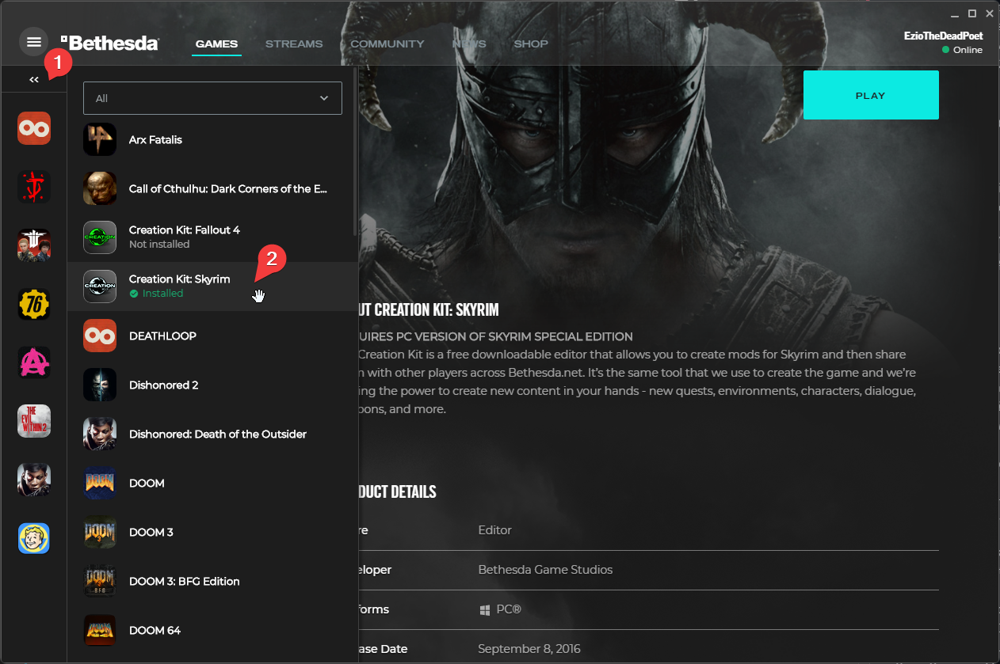
- Open the installation location. 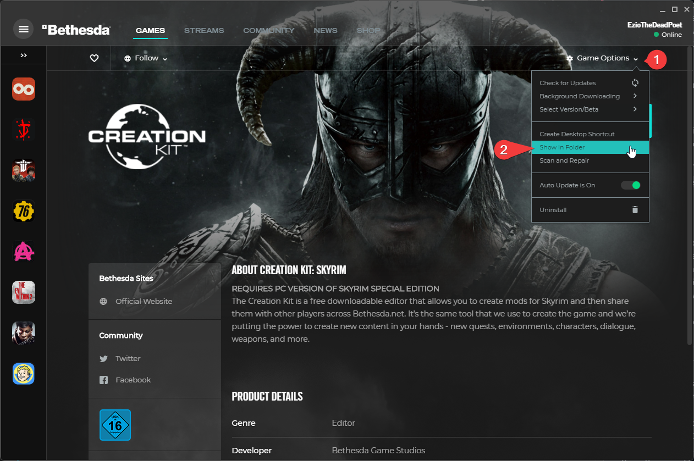
- Copy the Creation Kit Files into the SME(FT) game folder, which based on the previous installation instructions would be `C:/Modlists/SME(FT)/Skyrim Special Edition/`. This are the files you need to copy: 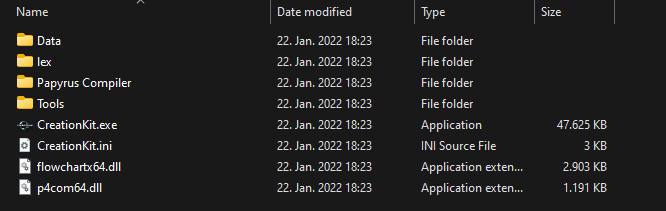

**The Creation Kit Fixes:** You will need the main file from [Tweaked Creation Kit Ini](https://www.nexusmods.com/skyrimspecialedition/mods/19817) and it is recommended to use [SSE Creation Kit Fixes](https://www.nexusmods.com/skyrimspecialedition/mods/20061) & [SSE Creation Kit FonixData Lip Sync Fix](https://www.nexusmods.com/skyrimspecialedition/mods/40971) alongside the Creation Kit. To setup the Creation Kit, complete the following steps.

1. Copy the Creation Kit.exe, CreationKit.ini & CreationKitPrefs.ini to the game root folder.
2. Extract and copy the Tweaked ini into the game root folder.
3. Copy the files from Creation Kit Fixes into the game root folder. If you receive a prompt to overwrite files, **do not overwrite**.
4. Install the Lip Sync Fix mod as normal in MO2.
5. Run the CK to test and make sure that it works.

#### xEdit & xEdit based applications (DynDOLOD, xLodGen)

Already configured.

#### Nemesis

For Nemesis to work with Stock Game, you need to adjust one of the lines in the Nemesis ini. To do this, complete the following steps.

1. Open the Nemesis mod and go to the `Ini Files` tab.
2. Select `Nemesis.Ini`
3. In the `SkyrimDataDirectory` line, change `auto` to the location of your data directory.
4. Save the ini file.

The picture below shows how the ini file should look.

#### Synthesis

Synthesis is relatively simple to configure for Stock Game. Like Nemesis, you just need to tell it where your game data folder is. To configure Synthesis, complete the following steps.

1. Run Synthesis and select the game you are using (in my case Skyrim Special Edition)
2. Click on the `Skyrim Special Edition` text in the top right corner.
3. In the `data folder location` field, add where your stock game is. It should look like the picture below.

4. Synthesis will auto-save this data and remember it for future times you run it.

#### zEdit

zEdit is again a relatively simple tool to configure for Stock Game. Like the previous two tools, you just need to tell it where your game data folder is. To configure zEdit, complete the following steps.

1. Run zEdit and select the tool you want. **Do not run any tool yet**
2. Press the settings cog to open the game profiles configuration.
3. Change the `Path` field to where your stock game is. It should look like the picture below.

4. Run the application to ensure that it picks up your data folder.

#### Easy NPC

EasyNPC does not require any special setup other than simply making sure the checkbox marked `Use mod directory setting from mod manager when available` is checked.

#### PCA SE

PCA SE does not require any special setup other than telling it where the game is.

#### BethINI / Visuals

After the installation is finished, go to your installation directory (`C:\SMEFT`), proceed into the `tools\BethINI` folder. Make sure Mod Organizer 2 and Skyrim are closed and start `BethINI.exe`. Select *Skyrim Special Edition* in the drop-down menu and proceed after reading the warning. Go to the *Setup* tab on the far-left of BethINI and select *Browse...* in the Mod Organizer drop-down menu. Browse to your installation folder and select `ModOrganizer.exe` inside. Now select the SMEFT profile in the Profiles drop-down menu, below the Mod Organizer label. Click *Yes* if BethINI asks whether it may modify custom INI files.

Go back to the Basic tab, check the box next to *Recommended Tweaks* and select the preset you think is right for your PC. Modern PCs should be fine with the *Medium* or *High* preset. People with high end PCs - I would recommend against the *Ultra* preset even with your RTX 3090 and Ryzen 9 5950X, unless you're going for a screen archery setup. The lost performance is better spent upping the settings quality of your favorite ENB preset. Click *Save and Exit* after you've applied the settings.

## How to Launch SME(FT)

Head over to the installation folder and locate an executable named `ModOrganizer.exe` and launch it. Once it's launched there will be a dropdown box on the top right and a big run button next to it. Ensure it is set to SKSE by selecting it in the dropdown box and then hitting the run button. Under the run button, you can find a shortcut menu that allows you to make a desktop shortcut.

*If the game doesn't launch correctly check [this](#windows-is-reporting-that-a-virus-has-been-detected) and the [pre-installation steps](#pre-installation) as those are the solution for the most common issues besides an failed installation.*

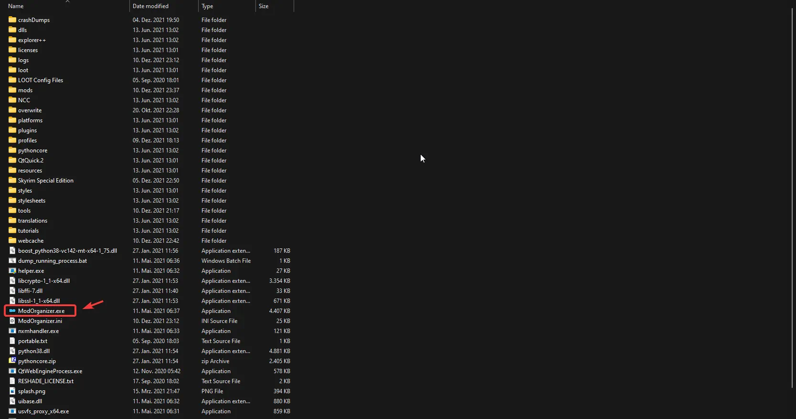

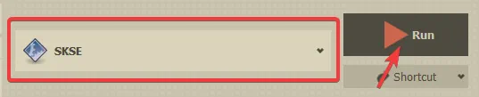

*The screenshots are from my other modlist so smeft will not exactly look like this.*

## Updating

You should not update smeft as it will delete all your modding you did on top of it.

**Wabbajack will delete all files that are not part of the modlist when updating!**

## Ultrawide Fix

[Complete Widescreen Fix](https://www.nexusmods.com/skyrimspecialedition/mods/1778) contains the necessary mods for ultrawide monitor users. Download and install these mods using Mod Organizer 2. The first file is found under the *Main Files* section of the mod files page, the rest are under *Optional Files*.

- `Complete Widescreen Fix for SkyUI 5.2 SE Alpha - 2560x1080`
  - Place this mod under `SkyUi` and keep both active (Patch)
- `Better Dialogue Control Widescreen Fix`
  - Disable `Better Dialogue Control` and place this mod under it (Replacer)
- `Better MessageBox Control Widescreen Fix`
  - Disable `Better MessageBox Control` and place this mod under it (Replacer)
- `SkyUI SE - Flashing Savegames FIx[sic] - Widescreen Fix`
  - Disable `Flashing Savegames Fix` and place this mod under it (Replacer)
- `Race Menu SE - Widescreen Fix (Optional Files)`
  - Place this mod under `RaceMenu` and keep both active (Patch)

Alternatively, an easier option that will result in a less vanilla-looking UI is [Dear Diary](https://www.nexusmods.com/skyrimspecialedition/mods/23010). It includes support for 21:9 and 32:9.

## FAQ

### Are there ultrawide options available?

Not included by default, but there are the instructions in the [Ultrawide Fixes Section](#ultrawide-fix).

## Credits and Thanks

- You, for actually reading the entirety of the README
- Akalonian for clearing up some of the installation instructions early on
- Lively and LadyZeefa for encouraging Luca to create this list
- ForgottenGlory for making SME(FT) possible due to his early support
- Halgari and everyone on the Wabbajack Team
- All the mod authors that made the mods featured in this list
- Luca for originally creating SME(FT)
- Special thanks to all the other people listed [here](https://eziothedeadpoet.github.io/AboutMe/HALLOFFAME.html) that support the project

## Contact

Trawzified and Luca are usually available on the [Wabbajack Discord](https://discord.gg/wabbajack). You may also message us on GitHub. Mod suggestions are alright, but keep in mind that they should be within the scope of the project.

**Do not contact mod authors with issues, approach us first. It's far more likely that there's an issue with this list rather than their mod, and we don't want to waste their time.**
